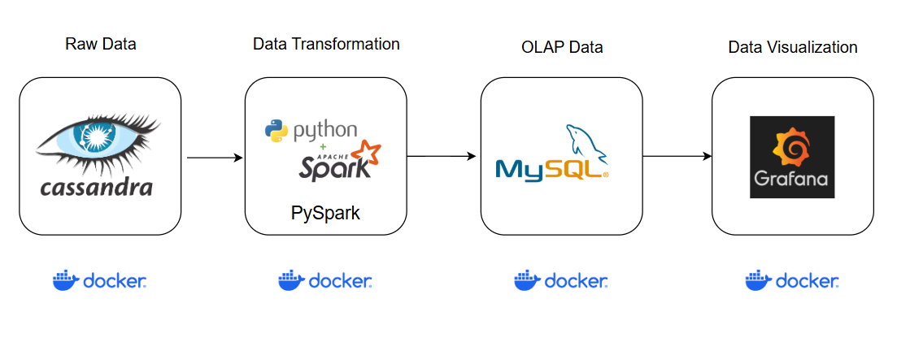

# Logs-Transform

## Objective
Build a data pipeline to process user log data from a recruitment website. 

The system uses Cassandra as data lake, PySpark for data transformation, stores processed data in MySQL for analysis and warehousing, and visualizes with Grafana. The entire stack is containerized with Docker.

## Architecture


## Raw data
[Tracking Data](/data/tracking.csv)

### Data Disctionary
| Column Name | Data Type |
|-------------|-----------|
 | create_time | string |
 | bid | integer |
 | bn | string |
 | campaign_id | integer |
 | cd | integer |
 | custom_track | string |
 | de | string |
 | dl | string |
 | dt | string |
 | ed | string |
 | ev | integer |
 | group_id | integer |
 | id | string |
 | job_id | integer |
 | md | string |
 | publisher_id | integer |
 | rl | string |
 | sr | string |
 | ts | string |
 | tz | integer |
 | ua | string |
 | uid | string |
 | utm_campaign | string |
 | utm_content | string |
 | utm_medium | string |
 | utm_source | string |
 | utm_term | string |
 | v | integer |
 | vp | string |


## Processing data
Data is processed in [Python_ETL_Pipeline](/Python_ETL_Pipeline.py) script.

## Clean data
### Data Disctionary
| Column Name | Data Type |
|-------------|-----------|
 | job_id | integer |
 | dates | timestamp |
 | hours| integer |
 | disqualified_application | integer |
 | qualified_application| integer |
 | conversion | integer |
 | company_id | integer |
 | group_id | integer |
 | campaign_id | integer |
 | publisher_id | integer |
 | bid_set | double |
 | clicks | integer |
 | impressions | string |
 | spend_hour | double |
 | sources | string |
 | latest_update_time | timestamp |

## Visualizing data

## Setup
- Docker: [docker-compose file](/docker-compose.yml)
    ```
    docker-compose -up -d
    ```

- Load data from csv to Cassandra

    Load CSV file to Cassandra in Jupyter Notebook: [here](/load_csv_to_cassandra.ipynb)

